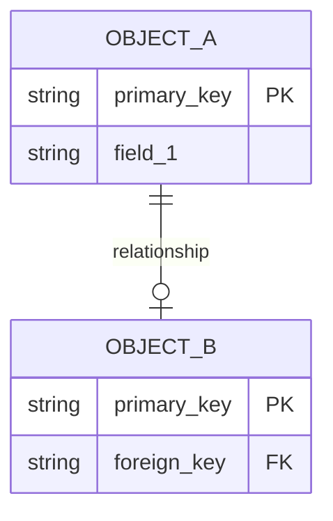

# Response style for Claude

- Always follow BESA (British English Spelling Always).
- Exceptions to BESA are allowed for proper nouns, acronyms, and specific terms.
- Exceptions are also allowed for coding languages and general code since syntax is often standardised in American English.
- Use British English spelling for all other words, specifically for documentation, README files, comments in code, user facing text, and any other text outputted that is not code.

> [!NOTE]
> Each repo may have its own standards. Make sure to read the repo's standards and IFF there is a conflict between the instructions above and the repo standards, first inform the user of the standards for the repo and tell them how to proceed. Whatever the answer is, include this in the local CLAUDE.md file for the project.

## Monzo OOM (Object-Oriented Modelling) Architecture

### Overview
Monzo's OOM architecture treats data as declarations of state changes for business objects. When you need to model events, simply provide raw event payloads and I'll create the necessary source files and generator files in the correct locations.

### Quick Workflow for Event Modelling
When you say "we need to model these events" and provide raw payloads:

1. **I will automatically:**
   - Analyse the event payloads to identify the business object
   - Create source files in `dbt/_sources/collective/squad/` 
   - Create generator YAML in `dbt/models/monzo-analytics-v2/collective/squad/_generators/` (v2 is for automated code)
   - Extract JSON paths and determine column types
   - Set up proper event mappings and transformations
   - Default to collective=operations and squad=ops-demand-insights-squad unless specified

2. **Then I'll guide you to:**
   - Run `dbt-monzo` to enter the dbt shell
   - Execute `modelgen generate --sources` to generate sources.yml
   - Execute `modelgen generate` to create the models
   - Run `dbt run -m <model_name>` commands
   - Provide command outputs for error checking

3. **I'll help with:**
   - Fixing any JSON path extraction issues
   - Handling complex transformations
   - Setting up composite keys if needed
   - Configuring time grids for mutable objects
   - Resolving any errors from the modelgen output

### Architecture Layers
- **Landing Layer**: Raw event ingestion (event_timeline, custom_source, import)
- **Normalised Layer**: Object-specific models (episodes, object, fact, mapping)
- **Logical Layer**: Combined objects with derived dimensions
- **Presentation Layer**: Business-specific views

### Key Concepts
- **Mutable Objects**: Can change state (generate episodes, object, object_time_grid)
- **Immutable Objects**: Single state (generate fact tables)
- **Object Mappings**: Relationships between objects
- **Generator Files**: YAML definitions that drive model generation

### Source File Structure (YAML files in dbt/_sources/)
Source files are YAML files, NOT SQL files. They follow this naming pattern:
- **File path**: `dbt/_sources/collective/squad/source_type.source_identifier.yml`
- **Supported source types**:
  - `bqinfoschema` → `INFORMATION_SCHEMA` views (Dynamic)
  - `event` → `sanitized-events-prod.sanitized_events` (Static)
  - `historical_snapshot` → `<project>.snapshot` (Dynamic)
  - `lending` → `monzo-analytics.lending` (Static)
  - `marketing_data` → `marketing-data-ingestion` (Dynamic)
  - `prod` → `monzo-analytics.prod` (Static)
  - `raw_event` → `raw-analytics-events-prod.raw_events` (Static)
  - `slurpee` → `monzo-analytics-pii.slurpee` (Dynamic)
  - `staging_event` → `sanitized-events-staging.sanitized_events` (Static)
  - `staging_raw_event` → `raw-analytics-events-staging.raw_events` (Static)
- **Example**: `staging_event.bizops_task_assessment_ground_truth_use_case_mapping_created.yml`

```yaml
description: >
  [Description of at least 70 characters explaining what this source represents]
freshness:
  warn_after: 1 day
  error_after: 2 day
loaded_at_field: ingestion_time
```

For sources without new data:
```yaml
description: [Description of at least 70 characters]
freshness: null
meta:
  has_new_data: false
loaded_at_field: ingestion_time
```

### Generator File Structure (Required Fields)
```yaml
collection: object  # ALWAYS 'object' for OOM architecture
created_at: 2025-06-12  # Date created (YYYY-MM-DD)
config:  # Required config block
  tags:
    - pii=true/false  # Required
    - collective=<collective>  # Required
    - owner=<squad>  # Required
    - run=nightly  # Optional but common
inputs:
  object_identifier: <unique_field>
  is_immutable: true/false
  localisation_configs: {}  # Required, usually empty
  sources:
    events:
      - dataset: sanitized_events  # or sanitized-events-staging.sanitized_events for staging
        tables: [event_names]
  generate_granular_models:  # For mutable objects
    daily:
      start_date: '2015-01-01'
  columns:
    - name: field_name
      type: STRING/INT64/TIMESTAMP/etc
      path: JSON_VALUE(payload, '$.path.to.field')
      is_null_valid_in_events: true/false
      event_names: [relevant.event.names]
```

### Common Tasks
- **Time Grids**: Add `generate_granular_models` with daily configuration
- **Composite Keys**: Use `composite_key_columns` for multi-field identifiers
- **Localisation**: Add `localisation_configs` for region-specific filtering
- **Complex JSON**: Use JSON_EXTRACT for arrays, JSON_VALUE for simple fields
- **Struct Fields**: Define nested structures with field definitions

### Critical JSON Path Rules
**NEVER use raw payload field access like `payload.field_name`**

Always use proper JSON extraction functions:
- **Simple fields**: `JSON_VALUE(payload, '$.field_name')`
- **Arrays/Objects**: `JSON_QUERY(payload, '$.field_name')` or `JSON_EXTRACT(payload, '$.field_name')`
- **Timestamps**: `TIMESTAMP(JSON_VALUE(payload, '$.field_name'))`
- **Complex logic**: Use CASE statements with proper JSON extraction

❌ **WRONG**: `path: payload.labels`
✅ **CORRECT**: `path: JSON_VALUE(payload, '$.labels')`

Common errors to avoid:
- Using `payload.field` instead of `JSON_VALUE(payload, '$.field')`
- Using dataset paths with dashes in generator files (use source names instead)
- Missing required fields like `created_at`, `config` block, `localisation_configs`

### Important Directory Structure
- **Use v2 for automated code**: `dbt/models/monzo-analytics-v2/` - This is the default for all OOM architecture
- **Legacy/custom solutions**: `dbt/models/monzo-analytics/` - Only use for old architecture or custom edge cases
- **Default collective**: operations (unless user specifies otherwise)
- **Default squad**: ops-demand-insights-squad (unless user specifies otherwise)

### Migration Interfaces (New into Old Architecture)
When new architecture models (v2) need to be used by old architecture models:
- **Use migration interfaces** to feed new architecture into old architecture
- Mark models as `access: protected` and add `meta.migration_interface: true`
- Only specific model types can be migration interfaces:
  - Normalized: object_dim, object_fact, episodes, object_time_grid, utility, object_mapping
  - Denormalized: concept, concept_episodes, concept_time_grid, logical_agg
- This is a **temporary solution** until old architecture is fully migrated

Example generator config:
```yaml
config:
  access:
    - value: protected
      applies_to: ["object_dim"]
meta:
  migration_interface:
    - value: true
      applies_to: ["object_dim"]
```

### Example Paths for Reference
- **Working generator example**: `dbt/models/monzo-analytics-v2/operations/ops-demand-insights-squad/_generators/vulnerable_customer_logs.yml`
- **Source files location**: `dbt/_sources/operations/ops-demand-insights-squad/`
- **Any generator file in v2 folder**: All files in `dbt/models/monzo-analytics-v2/*/squad/_generators/*.yml` are valid examples

Remember: The goal is to go from "here are raw event payloads" → fully generated dbt models with minimal manual intervention. Always default to v2 unless explicitly dealing with legacy code.

## Important Shell Command Notes

**NEVER use `cd` commands** - The user has a zoxide alias that will cause errors. Instead:
- Always use absolute paths when running commands
- Use `--directory` flags where available (e.g., with `uv`)
- Specify full paths to files and directories

Examples:
- ❌ WRONG: `cd /path/to/dir && command`
- ✅ CORRECT: `/full/path/to/command` or `command --directory /path/to/dir`

## MCP Tool Usage Requirements

1. **FIRST: Always use datetime MCP** to get current date/time if date/time is needed
   - Never assume or guess the current date/time
   - Always call `mcp__Datetime__now` when date/time information is required
   
2. **Always use calculator MCP** for ALL calculations - never guess or estimate
   - Use `mcp__calculator__calculate` for any mathematical operations
   - This includes simple arithmetic, percentages, conversions, etc.
   - Never perform mental calculations or estimates

## PR Descriptions for Analytics Work

When asked to create a PR description:

### File Naming
- **Always create an .md file**: `pr_description_<useful_title_relating_to_changes>_<timestamp>.md`
- **Use descriptive titles**: e.g. `pr_description_ground_truth_data_models_20250612_152832.md`
- **Get timestamp with**: `date +"%Y%m%d_%H%M%S"`

### Structure Requirements
Follow `refactor/pr_template_guidelines.md` structure:
- 📋 Summary (brief overview)
- 📊 Data Flow Diagram (Mermaid)
- 🗂️ Entity Relationship Diagram (Mermaid, if applicable)
- 🎯 Goals
- 🔍 Changes in this PR
- 🧪 Testing
- 📋 Notes for Reviewers
- 🔜 Future Work

### Mermaid Diagrams (Essential for Modelling Work)

**Data Flow Diagram** - Show the complete pipeline:
```mermaid
graph TD
    classDef source fill:#d4f1f9,stroke:#05a0c8,stroke-width:1px,color:black,rx:5,ry:5;
    classDef landing fill:#e1d5e7,stroke:#9673a6,stroke-width:1px,color:black,rx:5,ry:5;
    classDef normalised fill:#d5e8d4,stroke:#82b366,stroke-width:1px,color:black,rx:5,ry:5;
```

**Entity Relationship Diagram** - Show object relationships:


### Key Points
- Keep descriptions concise but informative
- Include color-coded legends for diagrams
- Show data lineage from sources through OOM layers
- Highlight testing results and any issues resolved
- Focus on business value and technical implementation